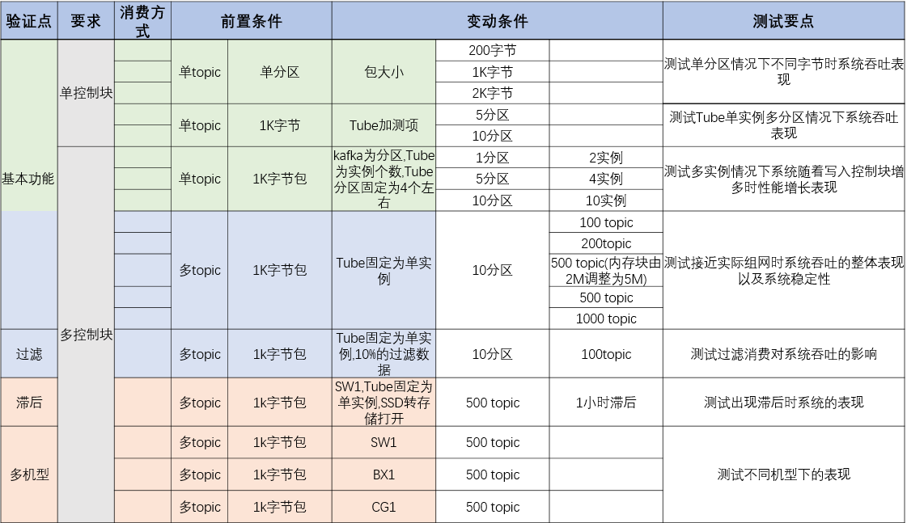
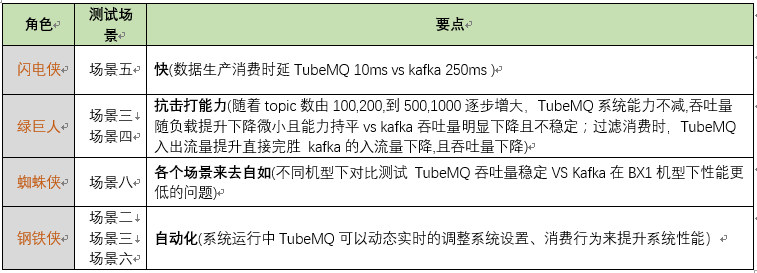
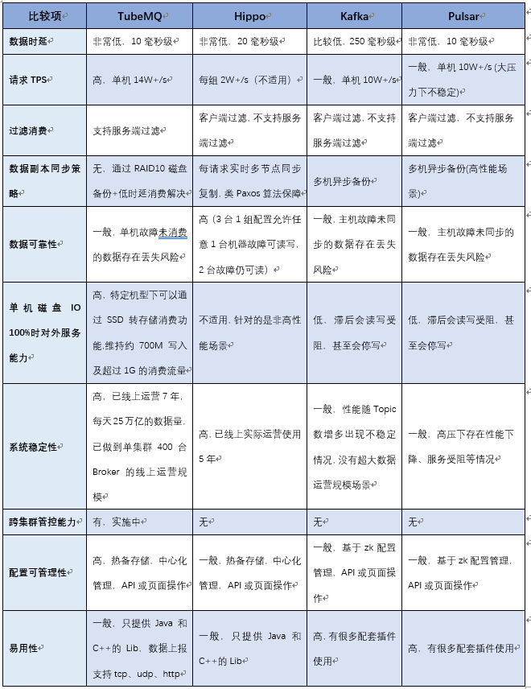
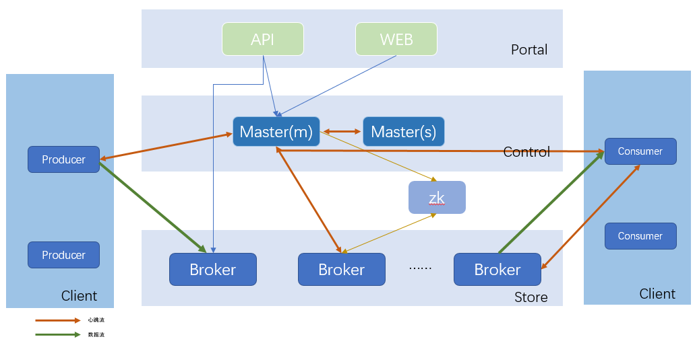
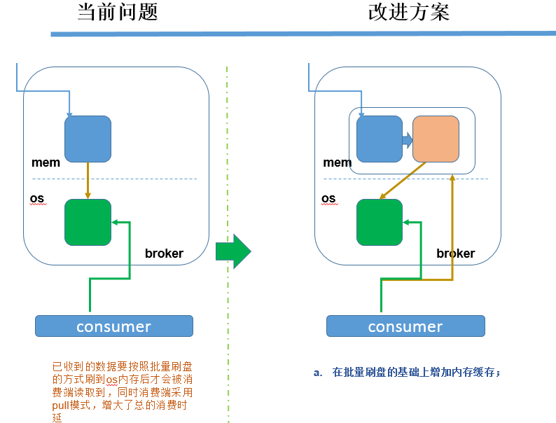
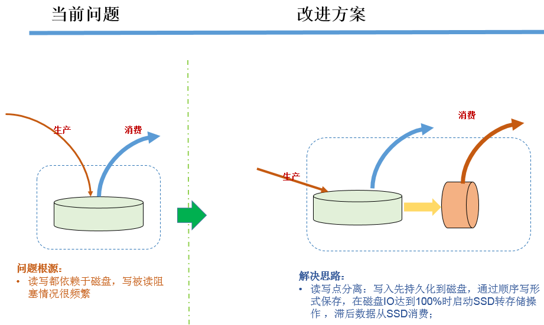

# TubeMQ总体介绍

> TubeMQ是腾讯大数据在2013年开始研发的分布式消息中间件系统（MQ），专注服务大数据场景下海量数据的高性能存储和传输。经过近7年上万亿的海量数据沉淀，较之于众多的开源MQ组件，TubeMQ在海量实践（稳定性+性能）和低成本方面有一定的优势，近期我们在开源TubeMQ的相关代码及设计，更多资料正在陆续整理和上传之中。更多疑问，请联系： gosonzhang@tencent.com, junpingdu@tencent.com

## TubeMQ的性能： ##
从TubeMQ架构图可以很清晰的看到，作为分布式的消息中间件系统，Broker单节点的性能情况直接影响到集群总体的性能表现，即相同的节点数下Broker节点性能越高则TubeMQ的总体性能越强。下表是根据我们多年的线上运营经验总结的典型场景：

通过对TubeMQ与Kafka进行对比测试分析（详情见《TubeMQ VS Kafka性能对比测试总结V1.0.md》），在1份写入2份并行消费的场景下，从机型、关键配置、系统测试结果数据的对比中我们可以很清晰的看到TubeMQ的性能情况，用大家熟悉的复仇者联盟角色类比，相当于是如下表的情况总结:

总的来说：Kafka按照**顺序写 + 顺序块读**的模式实现，单实例下性能数据很强，但随着实例数增多，它的性能就呈现不稳定下降状态；TubeMQ采用**顺序写 + 随机读**的模式，即使在最大限制下系统仍可以做到长期稳定的1G以上的入流量，同时，结合服务端过滤过滤消费非常顺畅。

## 与当前MQ横向对比分析： ##
下表是TubeMQ与主流MQ做的一个整体情况对比，便于大家快速粗略的了解TubeMQ与其他的MQ之间的差异。需要注意的是，相比其他MQ，基于成本和异步复制仍有丢数据的考虑，TubeMQ没有纳入多副本实现，相关高可靠的业务应用通过另一套实时多副本MQ Hippo来提供相应服务；TubeMQ在接下来版本中有计划进行多副本的实现处理。如下是相关特性比较：

## TubeMQ集群架构： ##
经过多年演变，TubeMQ集群分为如下5个部分：

- **Portal：** 负责对外交互和运维操作的Portal部分，包括API和Web两块，API对接集群之外的管理系统，Web是在API基础上对日常运维功能做的页面封装；

- **Master：** 负责集群控制的Control部分，该部分由1个或多个Master节点组成，Master HA通过Master节点间心跳保活、实时热备切换完成（这是大家使用TubeMQ的Lib时需要填写对应集群所有Master节点地址的原因），主Master负责管理整个集群的状态、资源调度、权限检查、元数据查询等；

- **Broker：** 负责实际数据存储的Store部分，该部分由相互之间独立的Broker节点组成，每个Broker节点对本节点内的Topic集合进行管理，包括Topic的增、删、改、查，Topic内的消息存储、消费、老化、分区扩容、数据消费的offset记录等，集群对外能力，包括Topic数目、吞吐量、容量等，通过水平扩展Broker节点来完成；

- **Client：** 负责数据生产和消费的Client部分，该部分我们以Lib形式对外提供，大家用得最多的是消费端，相比之前，消费端现支持Push、Pull两种数据拉取模式，数据消费行为支持顺序和过滤消费两种。对于Pull消费模式，支持业务通过客户端重置精确offset以支持业务extractly-once消费，同时，消费端新推出跨集群切换免重启的BidConsumer客户端；

- **Zookeeper：** 负责offset存储的zk部分，该部分功能已弱化到仅做offset的持久化存储，考虑到接下来的多节点副本功能该模块暂时保留。

## 相比Kafka,TubeMQ的系统特点： ##

1. **纯Java实现语言：** TubeMQ采用纯Java语言开发，便于开发人员快速熟悉项目及问题处理；

2. **引入Master协调节点：** 相比Kafka依赖于Zookeeper完成元数据的管理和实现HA保障不同，TubeMQ系统采用的是自管理的元数据仲裁机制方式进行，Master节点通过采用内嵌数据库BDB完成集群内元数据的存储、更新以及HA热切功能，负责TubeMQ集群的运行管控和配置管理操作，对外提供接口等；通过Master节点，TubeMQ集群里的Broker配置设置、变更及查询实现了完整的自动化闭环管理，减轻了系统维护的复杂度；

3. **服务器侧消费负载均衡：** TubeMQ采用的是服务侧负载均衡的方案，而不是客户端侧操作，提升系统的管控能力同时简化客户端实现，更便于均衡算法升级；

4. **系统行级锁操作：** 对于Broker消息读写中存在中间状态的并发操作采用行级锁，避免重复问题；

5. **Offset管理调整：** Offset由各个Broker独自管理，ZK只作数据持久化存储用（最初考虑完全去掉ZK依赖，考虑到后续的功能扩展就暂时保留）；

6. **消息读取机制的改进：** 相比于Kafka的顺序块读,TubeMQ采用的是消息随机读取模式,同时为了降低消息时延又增加了内存缓存读写,对于带SSD设备的机器,增加消息滞后转SSD消费的处理，解决消费严重滞后时吞吐量下降以及SSD磁盘容量小、刷盘次数有限的问题，使其满足业务快速生产消费的需求（后面章节详细介绍）；

7. **消费者行为管控：** 支持通过策略实时动态地控制系统接入的消费者行为，包括系统负载高时对特定业务的限流、暂停消费，动态调整数据拉取的频率等；

8. **服务分级管控：** 针对系统运维、业务特点、机器负载状态的不同需求，系统支持运维通过策略来动态控制不同消费者的消费行为，比如是否有权限消费、消费时延分级保证、消费限流控制，以及数据拉取频率控制等；

9. **系统安全管控：** 根据业务不同的数据服务需要，以及系统运维安全的考虑，TubeMQ系统增加了TLS传输层加密管道，生产和消费服务的认证、授权，以及针对分布式访问控制的访问令牌管理，满足业务和系统运维在系统安全方面的需求；

10. **资源利用率提升改进：** 相比于Kafka，TubeMQ采用连接复用模式，减少连接资源消耗；通过逻辑分区构造，减少系统对文件句柄数的占用，通过服务器端过滤模式，减少网络带宽资源使用率；通过剥离对Zookeeper的使用，减少Zookeeper的强依赖及瓶颈限制；

11. **客户端改进：** 基于业务使用上的便利性以，我们简化了客户端逻辑，使其做到最小的功能集合，我们采用基于响应消息的接收质量统计算法来自动剔出坏的Broker节点，基于首次使用时作连接尝试来避免大数据量发送时发送受阻（具体内容见后面章节介绍）。

## Broker文件存储方案改进： ##
以磁盘为数据持久化媒介的系统都面临各种因磁盘问题导致的系统性能问题，TubeMQ系统也不例外，性能提升很大程度上是在解决消息数据如何读写及存储的问题，在这个方面TubeMQ进行了比较多的改进：

1. **文件结构组织形式调整：** TubeMQ的磁盘存储方案类似Kafka，但又不尽相同，如下图示，存储实例由一个索引文件和一个数据文件组成，每个Topic可以分配1个或者多个存储实例，每个Topic单独维护管理存储实例的相关机制，包括老化周期，partition个数，是否可读可写等：

2. **内存块缓存：** 在文件存储基础上，我们针对每个存储实例又额外增加了一个单独的内存缓存块，即在原有写磁盘基础上增加一块内存，隔离硬盘的慢速影响，数据先刷到内存，然后由内存控制块批量地将数据刷到磁盘文件：

3. **SSD辅助存储：** 针对除了由磁盘存储外还带SSD硬件的服务器，我们又做了一层SSD辅助存储，该方案有别于外界系统先将数据存SSD，然后再将数据由SSD转到磁盘的通常做法：按照我们的分析，正常情况下磁盘的顺序读写性能已足够满足数据持久化的需求，磁盘IO到100%时的性能下降主要是由于滞后消费引起，滞后的比例越大影响越大；SSD相比磁盘，虽然读写速度近似内存但写入次数有限，像MQ这种每天大量写的系统很有可能因为SSD突然变得不可写带来系统风险。基于这些考虑，我们采用了动态的SSD转存储消费方案：正常情况下数据走磁盘读写消费；数据挤压情况出现，并且持续的状态触发运维设置的阀值时，滞后的数据消费将被转移到SSD上进行；数据挤压情况解除后，SSD停用数据继续走磁盘进行读写，这样在磁盘IO飙升时候将滞后消费读进行转移，避免读写集中在SATA盘上：

目前我们仍在探索新的存储方案，后续版本中我们会将实践后的内容分享到大家。

## TubeMQ客户端的演进： ##
业务与TubeMQ接触得最多的是消费侧，怎样更适应业务特点、更方便业务使用我们在这块做了比较多的改进：

- **数据拉取模式支持Push、Pull：**
	- **Push客户端：** TubeMQ最初消费端版本只提供Push模式的消费，这种模式能比较快速地消费数据，减轻服务端压力，但同时也带来一个问题，业务使用的时候因为无法控制拉取频率，从而容易形成数据积压数据处理不过来；

	- **带消费中止/继续的Push客户端：** 在收到业务反馈能否控制Push拉取动作的需求后，我们增加了resumeConsume()/pauseConsume()函数对，让业务可以模拟水位线控制机制，状态比较繁忙时调用pauseConsume()函数来中止Lib后台的数据拉取，在状态恢复后，再调用resumeConsume()通知Lib后台继续拉取数据；

	- **Pull客户端：** 我们后来版本里增加了Pull客户端，该客户端有别于Push客户端，是由业务而非Lib主动的拉取消息并对数据处理的结果进行成功与否的确认，将数据处理的主动权留给业务。这样处理后，虽然服务端压力有所提升，但业务消费时积压情况可大大缓解。

- **数据消费行为支持顺序和过滤消费：** 在TubeMQ设计初我们考虑是不同业务使用不同的Topic，实际运营中我们发现不少业务实际上是通过代理模式上报的数据，数据通过Topic下的文件ID或者表ID属性来区分，业务为了消费自己的一份数据是需要全量消费该Topic下的所有数据。我们通过tid字段支持指定属性的过滤消费模式，将数据过滤放到服务端来做，减少出流量以及客户端的数据处理压力。

- **支持业务extractly-once消费：** 为了解决业务处理数据时需要精确回档的需求，在客户端版本里提供了通过客户端重置精确offset功能，业务重启系统时，只需通过客户端提供待回拨时间点的消费上下文，TubeMQ即可按照指定的精确位置接续消费。该特性目前已在Flink这类实时计算框架使用，依托Flink基于checkpoint机制进行extractly-once数据处理。

---
<a href="#top">Back to top</a>