# TubeMQ管控台操作指引

## 管控台关系

​        TubeMQ管控台是管理TubeMQ集群的简单运营工具，包括集群里的Master、Broker，以及Broker上部署的Topic元数据等与TubeMQ系统相关的运营数据及操作。需要说明的是，当前提供的TubeMQ前台所提供的功能没有涵盖TubeMQ所提供的功能范围，大家可以参照《TubeMQ HTTP访问接口定义.xls》定义自行实现符合业务需要的管控前台。TubeMQ管控台的访问地址为http://portal:webport/config/topic_list.htm：
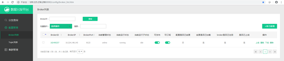
​       其中portal为该集群中任意的主、备Master的IP地址，webport为配置的Master的Web端口。

## TubeMQ管控台各版面介绍

​        管控台一共3项内容：分发查询，配置管理，集群管理；配置管理又分为Broker列表，Topic列表2个部分，我们先介绍简单的分发查询和集群管理，然后再介绍复杂的配置管理。

### 分发查询

​        点分发查询，我们会看到如下的列表信息，这是当前TubeMQ集群里已注册的消费组信息，包括具体的消费组组名，消费的Topic，以及该组总的消费分区数简介信息，如下图示：
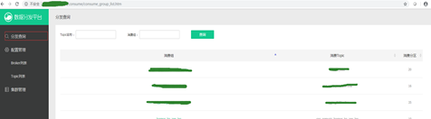
​       点击记录，可以看到选中的消费组里的消费者成员，及对应消费的Broker及Partition分区信息，如下图示：
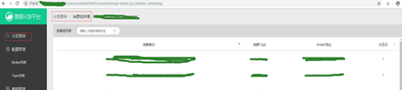

​       这个页面可以供我们查询，输入Topic或者消费组名，就可以很快确认系统里有哪些消费组在消费Topic，以及每个消费组的消费目标是怎样这些信息。

### 集群管理

​        集群管理主要管理Master的HA，在这个页面上我们可以看到当前Master的各个节点及节点状态，同时，我们可以通过“切换”操作来改变节点的主备状态。
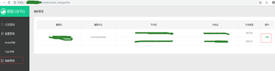

### 配置管理

​        配置管理版面既包含了Broker、Topic元数据的管理，还包含了Broker和Topic的上线发布以及下线操作，有2层含义，比如Broker列表里，展示的是当前集群里已配置的Broker元数据，包括未上线处于草稿状态、已上线、已下线的Broker记录信息：
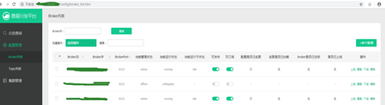

​        从页面信息我们也可以看到，除了Broker的记录信息外，还有Broker在该集群里的管理信息，包括是否已上线，是否处于命令处理中，是否可读，是否可写，配置是否做了更改，是否已加载变更的配置信息。

​        点单个新增，会弹框如下，这个表示待新增Broker的元数据信息，包括BrokerID，BrokerIP，BrokerPort，以及该Broker里部署的Topic的缺省配置信息，相关的字段详情见《TubeMQ HTTP访问接口定义.xls》
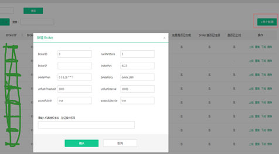

​        所有TubeMQ管控台的变更操作，或者改变操作，都会要求输入操作授权码，该信息由运维通过Master的配置文件master.ini的confModAuthToken字段进行定义：如果你知道这个集群的密码，你就可以进行该项操作，比如你是管理员，你是授权人员，或者你能登陆这个master的机器拿到这个密码，都认为你是有权操作该项功能。

## TubeMQ管控台上涉及的操作及注意事项

​       如上所说，TubeMQ管控台是运营Tube MQ集群的，套件负责包括Master、Broker这类TubeMQ集群节点管理，包括自动部署和安装等，因此，如下几点需要注意：

​       1． **TubeMQ集群做扩缩容增、减Broker节点时，要先在TubeMQ管控台上做相应的节点新增、上线，以及下线、删除等操作后才能在物理环境上做对应Broker节点的增删处理**：

​        TubeMQ集群对Broker按照状态机管理，如上图示涉及到[draft，online，read-only，write-only，offline] 等状态，记录增加还没生效时是draft状态，确定上线后是online态；节点删除首先要由online状态转为offline状态，然后再通过删除操作清理系统内保存的该节点记录；draft、online和offline是为了区分各个节点所处的环节，Master只将online状态的Broker分发给对应的producer和consumer进行生产和消费；read-only，write-only是Broker处于online状态的子状态，表示只能读或者只能写Broker上的数据；相关的状态及操作见页面详情，增加一条记录即可明白其中的关系。TubeMQ管控台上增加这些记录后，我们就可以进行Broker节点的部署及启动，这个时候Tube集群环境的页面会显示节点运行状态，如果为unregister状态，如下图示，则表示节点注册失败，需要到对应broker节点上检查日志，确认原因。目前该部分已经很成熟，出错信息会提示完整信息，大家可以直接根据提示作问题处理。
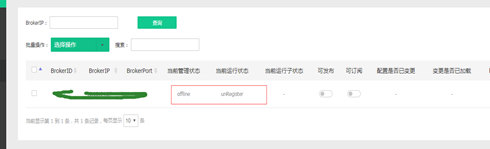
​        2． **Topic元数据信息需要通过套件的业务使用界面进行新增和删除操作：**

​       如下图，业务发现自己消费的Topic在TubeMQ管控台上没有，则需要在TubeMQ的管控台上直接操作：
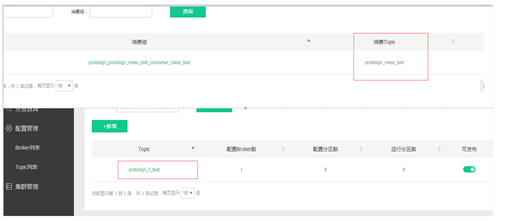

​       我们通过如上图中的Topic列表项完成Topic的新增，会弹出如下框，
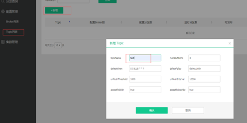

​       点击确认后会有一个选择部署该新增Topic的Broker列表，选择部署范围后进行确认操作：
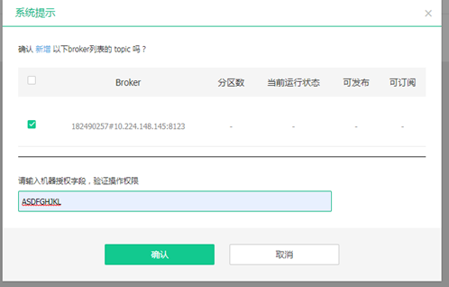

​       在完成新增Topic的操作后，我们还需要对刚进行变更的配置对Broker进行重载操作，如下图示：
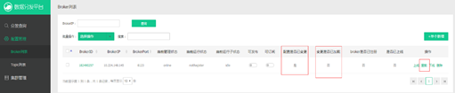

​       重载完成后Topic才能对外使用，我们会发现如下配置变更部分在重启完成后已改变状态：
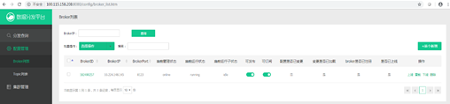

​       这个时候我们就可以针对该Topic进行生产和消费处理。

## 3．对于Topic的元数据进行变更后的操作注意事项：

**a.如何自行配置Topic参数：**

​       大家点击Topic列表里任意Topic后，会弹出如下框，里面是该Topic的相关元数据信息，其决定了这个Topic在该Broker上，设置了多少个分区，当前读写状态，数据刷盘频率，数据老化周期和时间等信息：
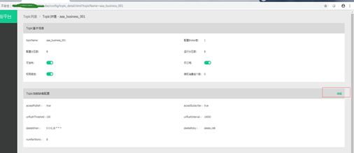

​       这些信息由系统管理员设置好默认值后直接定义的，一般不会改变，若业务有特殊需求，比如想增加消费的并行度增多分区，或者想减少刷盘频率，怎么操作？如下图示，各个页面的字段含义及作用如下表：

| 配置项              | 配置名                                | 字段类型 | 说明                                                         |
| ------------------- | ------------------------------------- | -------- | ------------------------------------------------------------ |
| topicName           | topic名称                             | String   | 字串长度(0,64],以字母开头的字母，数字，下划线的字符串，如果批量新增topic，topic值以","隔开，最大批量值为50条 |
| brokerId            | broker的ID                            | int      | 待新增的BrokerId，批量操作的brokerId数字以","隔开，最大批量操作量不超过50 |
| deleteWhen          | topic数据删除时间                     | String   | 按照crontab的配置格式定义，如“0 0 6,18 * *   ?”，缺省为broker的对应字段缺省配置 |
| deletePolicy        | 删除策略                              | String   | topic数据删除策略，类似"delete,168"定义，缺省为broker的对应字段缺省配置 |
| numPartitions       | topic在该broker上的分区量             | int      | 缺省为broker的对应字段缺省配置                               |
| unflushThreshold    | 最大允许的待刷新的记录条数            | int      | 最大允许的未flush消息数，超过此值将强制force到磁盘，默认1000，缺省为broker的对应字段缺省配置 |
| unflushInterval     | 最大允许的待刷新的间隔                | int      | 最大允许的未flush间隔时间，毫秒，默认10000，缺省为broker的对应字段缺省配置 |
| numTopicStores      | 允许建立Topic数据块和分区管理组的个数 | int      | 缺省为1个,如果大于1则分区和topic对列按照该值倍乘关系         |
| memCacheMsgCntInK   | 缺省最大内存缓存包量                  | int      | 内存最大允许缓存的消息包总条数，单位为千条，缺省为10K，最少允许1K |
| memCacheMsgSizeInMB | 缺省内存缓存包总的Size大小            | int      | 内存最大允许缓存的消息包size总大小，单位为MB，缺省为2M，最小需要为2M |
| memCacheFlushIntvl  | 内存缓存最大允许的待刷新间隔          | int      | 内存最大允许未flush时间间隔，毫秒，默认20000ms,最小4000ms    |
| acceptPublish       | topic是否接收发布请求                 | boolean  | 缺省为true，取值范围[true，false]                            |
| acceptSubscribe     | topic是否接收订阅请求                 | boolean  | 缺省为true，取值范围[true，false]                            |
| createUser          | topic创建人                           | String   | 字串长度(0,32],以字母开头的字母，数字，下划线的字符串        |
| createDate          | 创建时间                              | String   | 字串格式:"yyyyMMddHHmmss",必须为14位按如上格式的数字字符串   |
| confModAuthToken    | 配置修改授权key                       | String   | 以字母开头的字母，数字，下划线的字符串,长度为（0，128]位     |

​       该部分字段相关字段详情见《Tube MQ HTTP访问接口定义.xls》，有很明确的定义。大家通过页面右上角的**修改**按钮进行修改，并确认后，会弹出如下框：
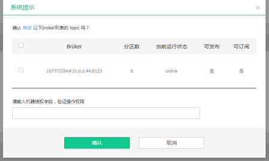

其作用是：a. 选择涉及该Topic元数据修改的Broker节点集合；b. 提供变更操作的授权信息码。

**特别提醒：大家还需要注意的是，输入授权码修改后，数据变更要刷新后才会生效，同时生效的Broker要按比例进行操作。**
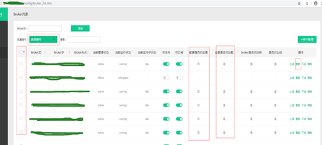

**b.Topic变更注意事项：**

​       如上图示，选择变更Topic元数据后，之前选中的Broker集合会在**配置是否已变更**上出现是的提示。我们还需要对变更进行重载刷新操作，选择Broker集合，然后选择刷新操作，可以批量也可以单条，但是一定要注意的是：操作要分批进行，上一批操作的Broker当前运行状态为running后才能进入下一批的配置刷新操作；如果有节点处于online状态，但长期不进入running状态（缺省最大2分钟），则需要停止刷新，排查问题原因后再继续操作。

​       进行分批操作原因是，我们系统在变更时，会对指定的Broker做停读停写操作，如果将全量的Broker统一做重载，很明显，集群整体会出现服务不可读或者不可写的情况，从而接入出现不该有的异常。

**c.对于Topic的删除处理：**

​       页面上进行的删除是软删除处理，如果要彻底删除该topic需要通过API接口进行硬删除操作处理才能实现（避免业务误操作）。

​       完成如上内容后，Topic元数据就变更完成。

---
<a href="#top">Back to top</a>