# TubeMQ VS Kafka性能对比测试总结

## 背景
TubeMQ是腾讯大数据自研的分布式消息中间件。其系统架构思想源于[Apache Kafka](http://kafka.apache.org/)。在实现上，则完全采取自适应的方式，结合实战做了很多优化及研发工作，如分区管理、分配机制和全新节点通讯流程，自主开发高性能的底层RPC通讯模块等。
这些实现使得TubeMQ在保证实时性和一致性的前提下，具有很好的健壮性及更高的吞吐能力。结合目前主流消息中间件使用情况，以Kafka为参照做性能对比测试，对比常规应用场景下两套系统性能。

## 测试场景方案
如下是我们根据实际应用场景设计的测试方案：
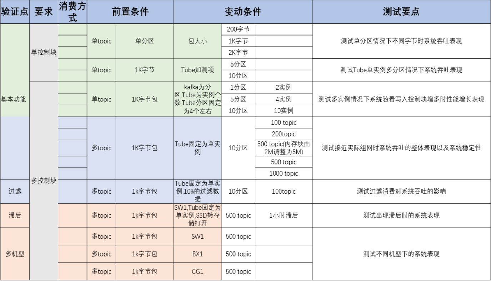

## 测试结论
用"复仇者联盟"里的角色来形容：

角色|测试场景|要点
:---:|:---:|---
闪电侠|场景五|快 (数据生产消费时延 TubeMQ 10ms vs kafka 250ms )
绿巨人|场景三，场景四|抗击打能力 (随着topic数由100,200,到500,1000逐步增大，TubeMQ系统能力不减，吞吐量随负载的提升下降微小且能力持平 vs kafka吞吐量明显下降且不稳定；过滤消费时，TubeMQ入出流量提升直接完胜kafka的入流量下降且吞吐量下降)
蜘蛛侠|场景八|各个场景来去自如(不同机型下对比测试，TubeMQ吞吐量稳定 vs Kafka在BX1机型下性能更低的问题)
钢铁侠|场景二，场景三，场景六|自动化(系统运行中TubeMQ可以动态实时的调整系统设置、消费行为来提升系统性能）
     
具体的数据分析来看：
1. 单Topic单实例配置下，TubeMQ吞吐量要远低于Kafka；单Topic多实例配置下，TubeMQ在4个实例时吞吐量追上Kafka对应5个分区配置，同时TubeMQ的吞吐量随实例数增加而增加，Kafka出现不升反降的情况；TubeMQ可以在系统运行中通过调整各项参数来动态的控制吞吐量的提升；
2. 多Topic多实例配置下，TubeMQ吞吐量维持在一个非常稳定的范围，且资源消耗，包括文件句柄、网络连接句柄数等非常的低；Kafka吞吐量随Topic数增多呈现明显的下降趋势，且资源消耗急剧增大；在SATA盘存储条件下，随着机型的配置提升，TubeMQ吞吐量可以直接压到磁盘瓶颈，而Kafka呈现不稳定状态；在CG1机型SSD盘情况下，Kafka的吞吐量要好于TubeMQ；
3. 在过滤消费时，TubeMQ可以极大地降低服务端的网络出流量，同时还会因过滤消费消耗的资源少于全量消费，反过来促进TubeMQ吞吐量提升；kafka无服务端过滤，出流量与全量消费一致，流量无明显的节约；
4. 资源消耗方面各有差异：TubeMQ由于采用顺序写随机读，CPU消耗很大，Kafka采用顺序写块读，CPU消耗很小，但其他资源，如文件句柄、网络连接等消耗非常的大。在实际的SAAS模式下的运营环境里，Kafka会因为zookeeper依赖出现系统瓶颈，会因生产、消费、Broker众多，受限制的地方会更多，比如文件句柄、网络连接数等，资源消耗会更大；

## 测试环境及配置
###【软件版本及部署环境】

**角色**|**TubeMQ**|**Kafka**
:---:|---|---
**软件版本**|tubemq-3.8.0|Kafka\_2.11-0.10.2.0
**zookeeper部署**|与Broker不在同一台机器上，单机|与Broker配置不在同一台机器，单机
**Broker部署**|单机|单机
**Master部署**|与Broker不在同一台机器上，单机|不涉及
**Producer**|1台M10 + 1台CG1|1台M10 + 1台CG1
**Consumer**|6台TS50万兆机|6台TS50万兆机

###【Broker硬件机型配置】

**机型**|配置|**备注**
:---:|---|---
**TS60**|(E5-2620v3\*2/16G\*4/SATA3-2T\*12/SataSSD-80G\*1/10GE\*2) Pcs|若未作说明，默认都是在TS60机型上进行测试对比
**BX1-10G**|SA5212M5(6133\*2/16G\*16/4T\*12/10GE\*2) Pcs|                                     
**CG1-10G**|CG1-10G\_6.0.2.12\_RM760-FX(6133\*2/16G\*16/5200-480G\*6 RAID/10GE\*2)-ODM Pcs |  

###【Broker系统配置】

| **配置项**            | **TubeMQ Broker**     | **Kafka Broker**      |
|:---:|---|---|
| **日志存储**          | Raid10处理后的SATA盘或SSD盘 | Raid10处理后的SATA盘或SSD盘 |
| **启动参数**          | BROKER_JVM_ARGS="-Dcom.sun.management.jmxremote -server -Xmx24g -Xmn8g -XX:SurvivorRatio=6 -XX:+UseMembar -XX:+UseConcMarkSweepGC -XX:+CMSParallelRemarkEnabled -XX:+CMSScavengeBeforeRemark -XX:ParallelCMSThreads=4 -XX:+UseCMSCompactAtFullCollection -verbose:gc -Xloggc:$BASE_DIR/logs/gc.log.`date +%Y-%m-%d-%H-%M-%S` -XX:+PrintGCDetails -XX:+PrintGCDateStamps -XX:+CMSClassUnloadingEnabled -XX:CMSInitiatingOccupancyFraction=75 -XX:CMSFullGCsBeforeCompaction=1 -Dsun.net.inetaddr.ttl=3 -Dsun.net.inetaddr.negative.ttl=1 -Dtubemq.fast_boot=false -Dtubemq.home=$tubemq_home -cp $CLASSPATH"|KAFKA_HEAP_OPTS="-Xms24g -Xmx24g -XX:PermSize=48m -XX:MaxPermSize=48m -XX:+UseG1GC -XX:MaxGCPauseMillis=20 -XX:InitiatingHeapOccupancyPercent=35
| **配置文件**          | 在tubemq-3.8.0版本broker.ini配置文件上改动: consumerRegTimeoutMs=35000 tcpWriteServiceThread=50 tcpReadServiceThread=50 primaryPath为SATA盘日志目录|kafka_2.11-0.10.2.0版本server.properties配置文件上改动： log.flush.interval.messages=5000 log.flush.interval.ms=10000 log.dirs为SATA盘日志目录 socket.send.buffer.bytes=1024000 socket.receive.buffer.bytes=1024000 socket.request.max.bytes=2147483600 log.segment.bytes=1073741824 num.network.threads=25 num.io.threads=48 log.retention.hours=5
| **其它**             | 除测试用例里特别指定，每个topic创建时设置： memCacheMsgSizeInMB=5 memCacheFlushIntvl=20000 memCacheMsgCntInK=10  unflushThreshold=5000 unflushInterval=10000 unFlushDataHold=5000 | 客户端代码里设置： 生产端： props.put("key.serializer", "org.apache.kafka.common.serialization.StringSerializer"); props.put("value.serializer", "org.apache.kafka.common.serialization.StringSerializer"); props.put("linger.ms", "200"); props.put("block.on.buffer.full", false); props.put("max.block.ms", "10"); props.put("batch.size", 50000); props.put("buffer.memory", 1073741824 ); props.put("metadata.fetch.timeout.ms", 30000); props.put("metadata.max.age.ms", 1000000); props.put("request.timeout.ms", 1000000); 消费端： props.put(ConsumerConfig.SESSION_TIMEOUT_MS_CONFIG, "30000");  props.put(ConsumerConfig.KEY_DESERIALIZER_CLASS_CONFIG, "org.apache.kafka.common.serialization.StringDeserializer"); props.put(ConsumerConfig.VALUE_DESERIALIZER_CLASS_CONFIG, "org.apache.kafka.common.serialization.StringDeserializer"); props.put(ConsumerConfig.ENABLE_AUTO_COMMIT_CONFIG, true/false); props.put(ConsumerConfig.AUTO_COMMIT_INTERVAL_MS_CONFIG, "10000");
              
## 测试场景及结论

### 场景一：基础场景，单topic情况，一入两出模型，分别使用不同的消费模式、不同大小的消息包，分区逐步做横向扩展，对比TubeMQ和Kafka性能
 

####【结论】

在单topic不同分区的情况下：
1. TubeMQ吞吐量不随分区变化而变化，同时TubeMQ属于顺序写随机读模式，单实例情况下吞吐量要低于Kafka，CPU要高于Kafka；
2. Kafka随着分区增多吞吐量略有下降，CPU使用率很低；
3. TubeMQ分区由于是逻辑分区，增加分区不影响吞吐量；Kafka分区为物理文件的增加，但增加分区入出流量反而会下降；

####【指标】
 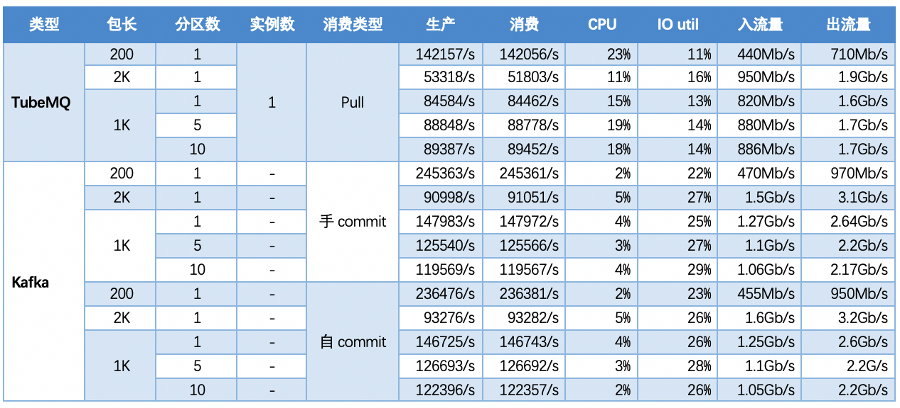

### 场景二：单topic情况，一入两出模型，固定消费包大小，横向扩展实例数，对比TubeMQ和Kafka性能情况
 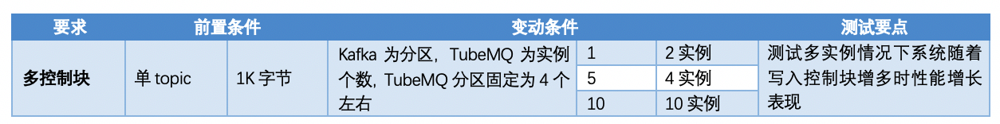

####【结论】

从场景一和场景二的测试数据结合来看：

1. TubeMQ随着实例数增多，吞吐量增长，在4个实例的时候吞吐量与Kafka持平，磁盘IO使用率比Kafka低，CPU使用率比Kafka高；
2. TubeMQ的消费方式影响到系统的吞吐量，内存读取模式（301）性能低于文件读取模式（101），但能降低消息的时延；
3. Kafka随分区实例数增多，没有如期提升系统吞吐量；
4. TubeMQ按照Kafka等同的增加实例（物理文件）后，吞吐量量随之提升，在4个实例的时候测试效果达到并超过Kafka
    5个分区的状态；TubeMQ可以根据业务或者系统配置需要，调整数据读取方式，可以动态提升系统的吞吐量；Kafka随着分区增加，入流量有下降；

####【指标】

**注1 :** 如下场景中，均为单Topic测试下不同分区或实例、不同读取模式场景下的测试，单条消息包长均为1K;

**注2 :**
读取模式通过admin\_upd\_def\_flow\_control\_rule设置qryPriorityId为对应值.
 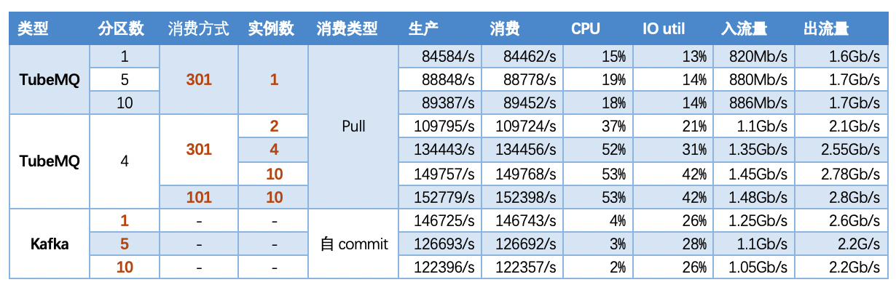

### 场景三：多topic场景，固定消息包大小、实例及分区数，考察100、200、500、1000个topic场景下TubeMQ和Kafka性能情况
 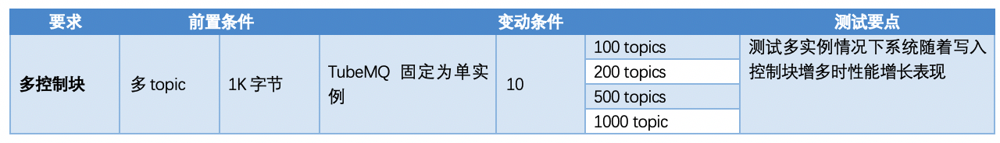

####【结论】

按照多Topic场景下测试：

1.  TubeMQ随着Topic数增加，生产和消费性能维持在一个均线上，没有特别大的流量波动，占用的文件句柄、内存量、网络连接数不多（1k
    topic下文件句柄约7500个，网络连接150个），但CPU占用比较大；
2.  TubeMQ通过调整消费方式由内存消费转为文件消费方式后，吞吐量有比较大的增长，CPU占用率有下降，对不同性能要求的业务可以进行区别服务；
3.  Kafka随着Topic数的增加，吞吐量有明显的下降，同时Kafka流量波动较为剧烈，长时间运行存消费滞后，以及吞吐量明显下降的趋势，以及内存、文件句柄、网络连接数量非常大(在1K
    Topic配置时，网络连接达到了1.2W，文件句柄达到了4.5W)等问题；
4.  数据对比来看，TubeMQ相比Kafka运行更稳定，吞吐量以稳定形势呈现，长时间跑吞吐量不下降，资源占用少，但CPU的占用需要后续版本解决；

####【指标】

**注：** 如下场景中，包长均为1K，分区数均为10。
 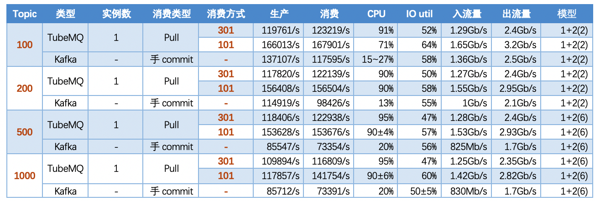

### 场景四：100个topic，一入一全量出五份部分过滤出：一份全量Topic的Pull消费；过滤消费采用5个不同的消费组，从同样的20个Topic中过滤出10%消息内容

####【结论】

1.  TubeMQ采用服务端过滤的模式，出流量指标与入流量存在明显差异；
2.  TubeMQ服务端过滤提供了更多的资源给到生产，生产性能比非过滤情况有提升；
3.  Kafka采用客户端过滤模式，入流量没有提升，出流量差不多是入流量的2倍，同时入出流量不稳定；

####【指标】

**注：** 如下场景中，topic为100，包长均为1K，分区数均为10
 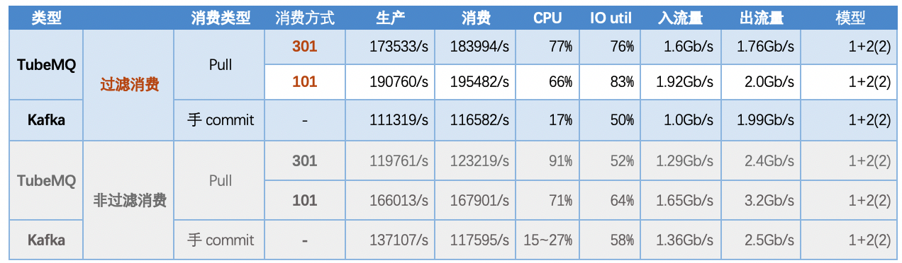

### 场景五：TubeMQ、Kafka数据消费时延比对

| 类型   | 时延            | Ping时延                |
|---|---|---|
| TubeMQ | 90%数据在10ms±  | C->B：0.05ms ~ 0.13ms, P->B：2.40ms ~ 2.42ms |
| Kafka  | 90%集中在250ms± | C->B：0.05ms ~ 0.07ms, P-\>B：2.95ms \~ 2.96ms |

备注：TubeMQ的消费端存在一个等待队列处理消息追平生产时的数据未找到的情况，缺省有200ms的等待时延。测试该项时，TubeMQ消费端要调整拉取时延（ConsumerConfig.setMsgNotFoundWaitPeriodMs()）为10ms，或者设置频控策略为10ms。

### 场景六：调整Topic配置的内存缓存大小（memCacheMsgSizeInMB）对吞吐量的影响

####【结论】

1.  TubeMQ调整Topic的内存缓存大小能对吞吐量形成正面影响，实际使用时可以根据机器情况合理调整；
2.  从实际使用情况看，内存大小设置并不是越大越好，需要合理设置该值；

####【指标】

 **注：** 如下场景中，消费方式均为读取内存（301）的PULL消费，单条消息包长均为1K
 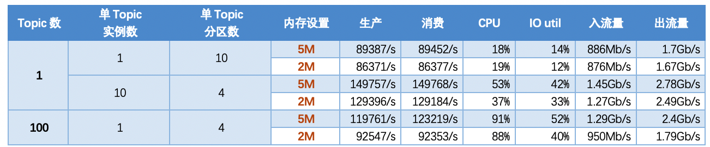
 

### 场景七：消费严重滞后情况下两系统的表现

####【结论】

1.  消费严重滞后情况下，TubeMQ和Kafka都会因磁盘IO飙升使得生产消费受阻；
2.  在带SSD系统里，TubeMQ可以通过SSD转存储消费来换取部分生产和消费入流量；
3.  按照版本计划，目前TubeMQ的SSD消费转存储特性不是最终实现，后续版本中将进一步改进，使其达到最合适的运行方式；

####【指标】
 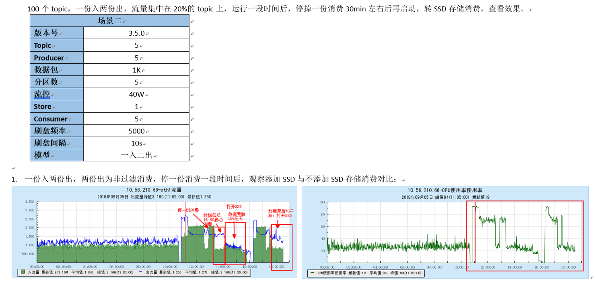

### 场景八：评估多机型情况下两系统的表现
 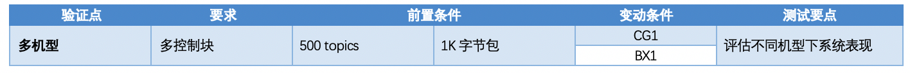
      
####【结论】

1.  TubeMQ在BX1机型下较TS60机型有更高的吞吐量，同时因IO util达到瓶颈无法再提升，吞吐量在CG1机型下又较BX1达到更高的指标值；
2.  Kafka在BX1机型下系统吞吐量不稳定，且较TS60下测试的要低，在CG1机型下系统吞吐量达到最高，万兆网卡跑满；
3.  在SATA盘存储条件下，TubeMQ性能指标随着硬件配置的改善有明显的提升；Kafka性能指标随硬件机型的改善存在不升反降的情况;
4.  在SSD盘存储条件下，Kafka性能指标达到最好，TubeMQ指标不及Kafka；
5.  CG1机型数据存储盘较小(仅2.2T)，RAID 10配置下90分钟以内磁盘即被写满，无法测试两系统长时间运行情况。

####【指标】

**注1:** 如下场景Topic数均配置500个topic，10个分区，消息包大小为1K字节;

**注2:** TubeMQ采用的是301内存读取模式消费；
 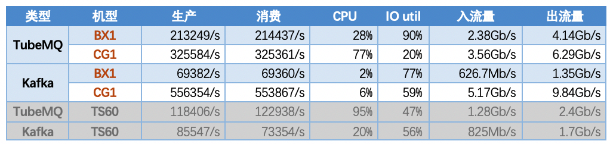

## 附录1 不同机型下资源占用情况图：
###【BX1机型测试】
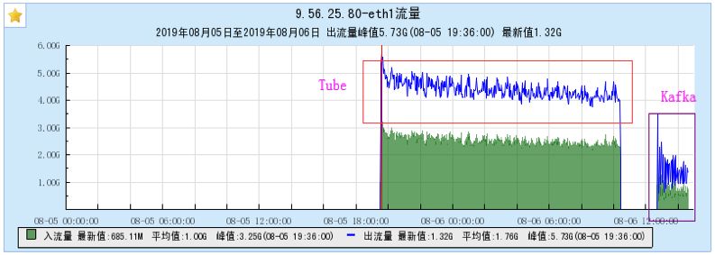
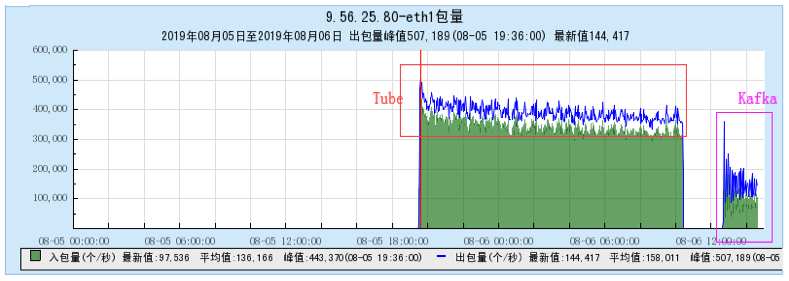
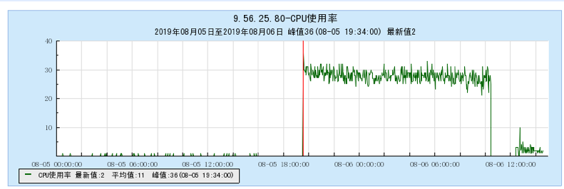
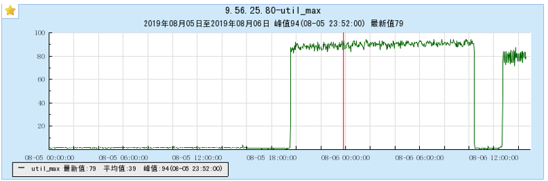

###【CG1机型测试】
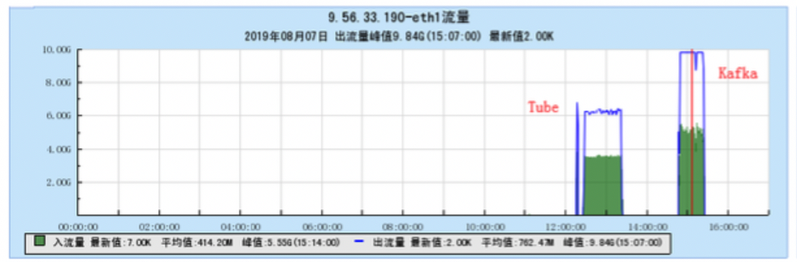
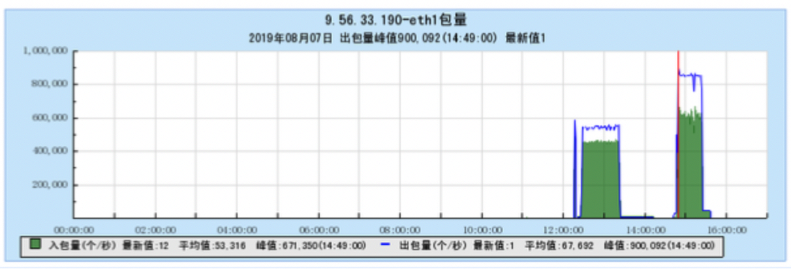
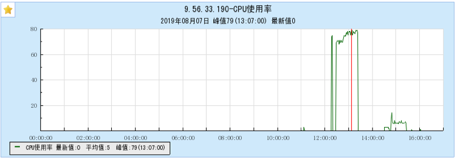
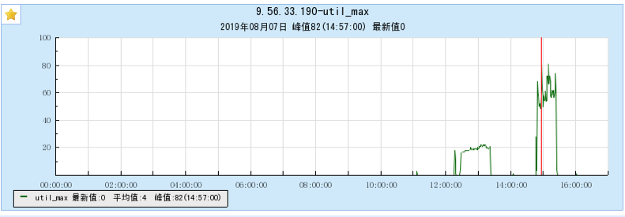

## 附录2 多Topic测试时的资源占用情况图：

###【100个topic】
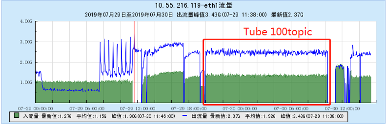
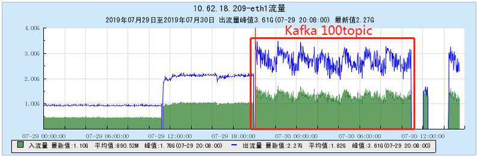
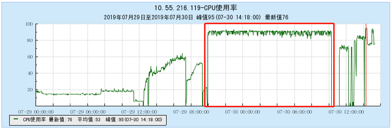
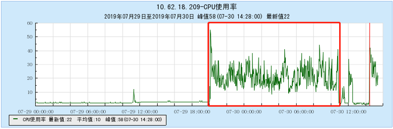
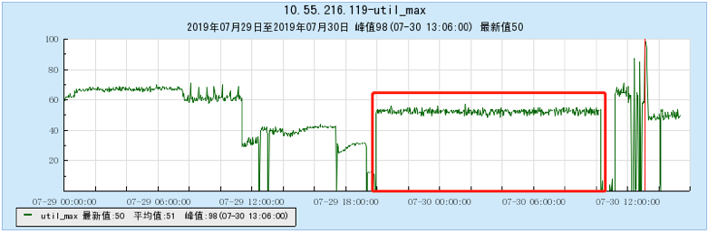
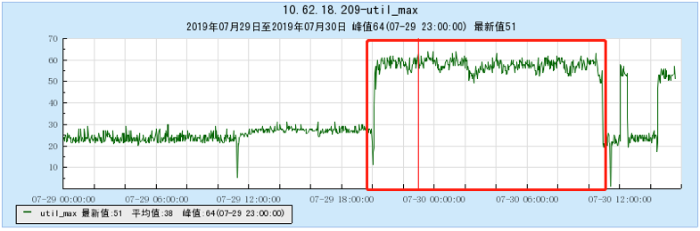
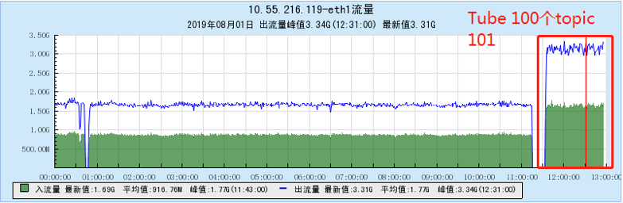
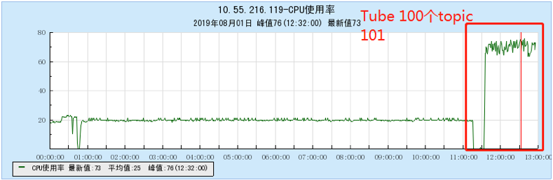
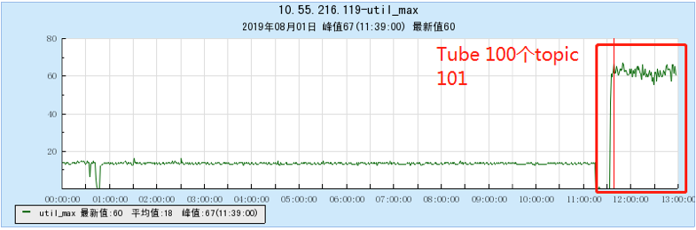
 
###【200个topic】
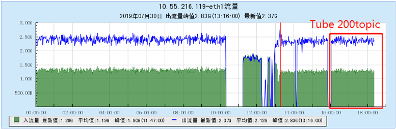
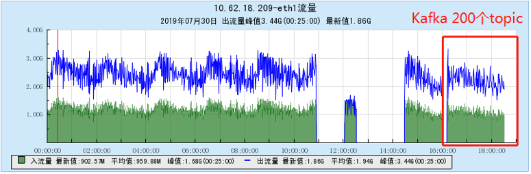
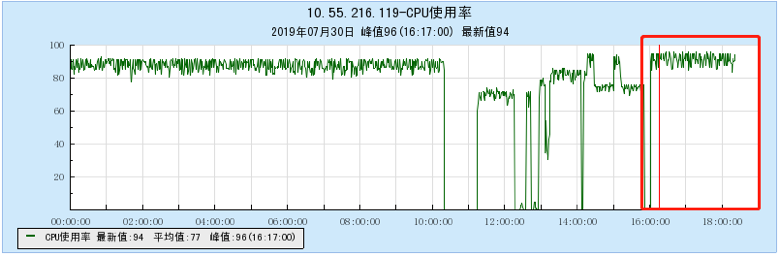
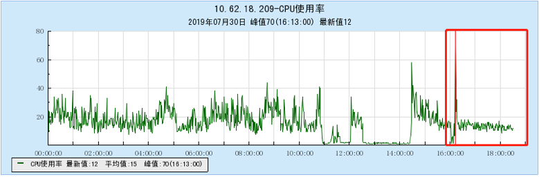
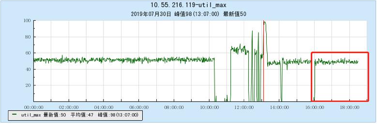
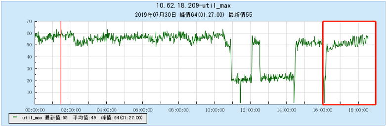
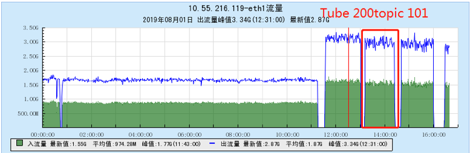
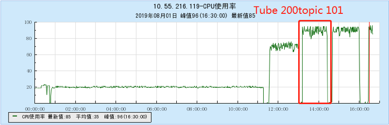
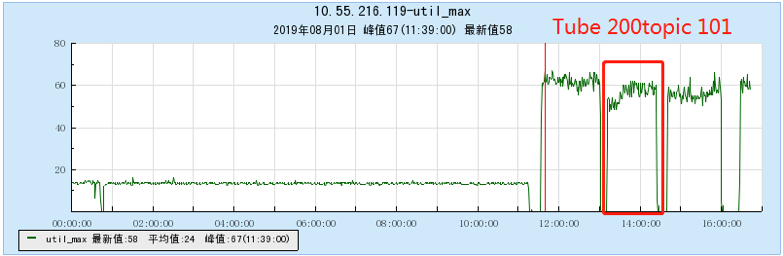

###【500个topic】
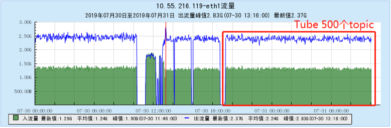
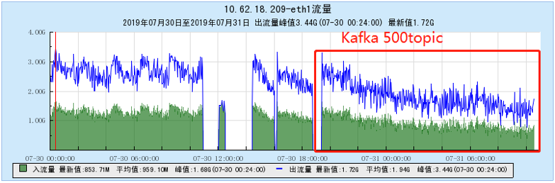
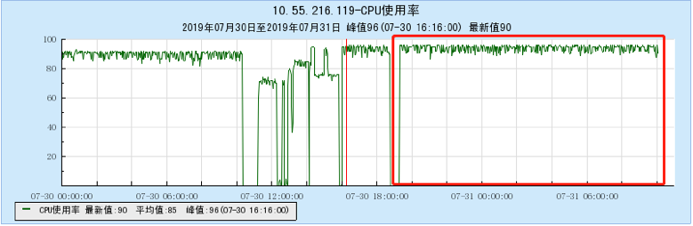
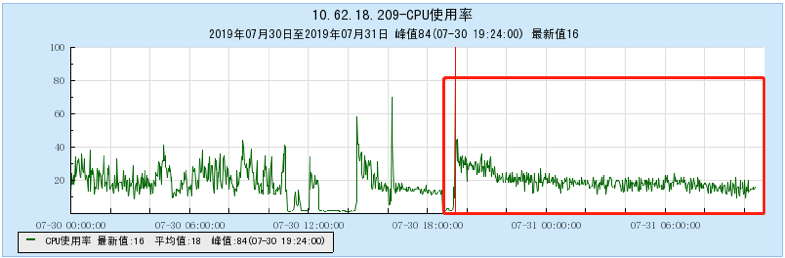
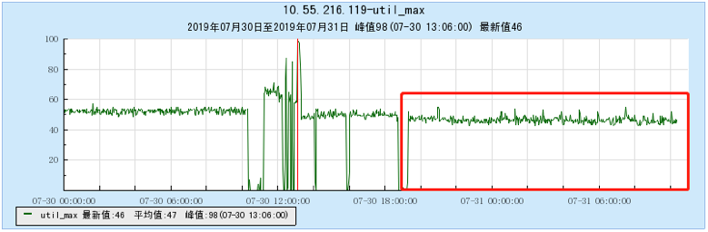
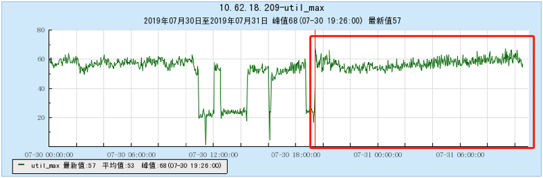

###【1000个topic】
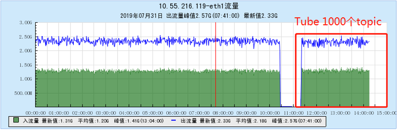
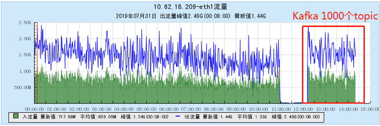
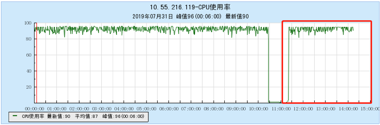
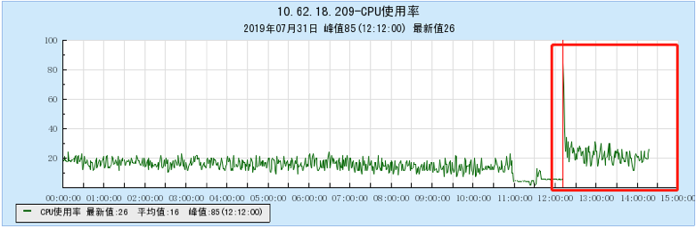
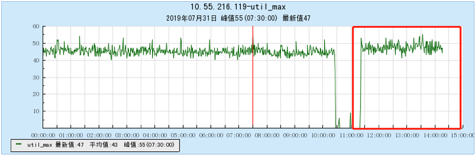
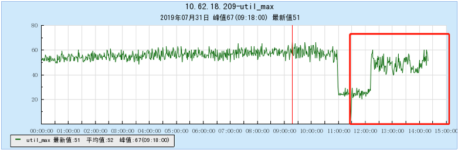
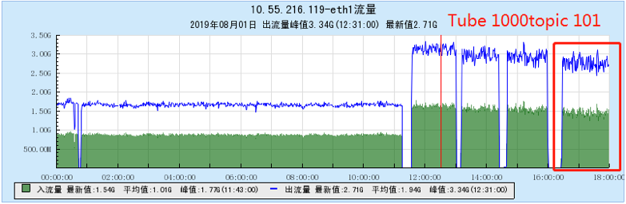


---
<a href="#top">Back to top</a>