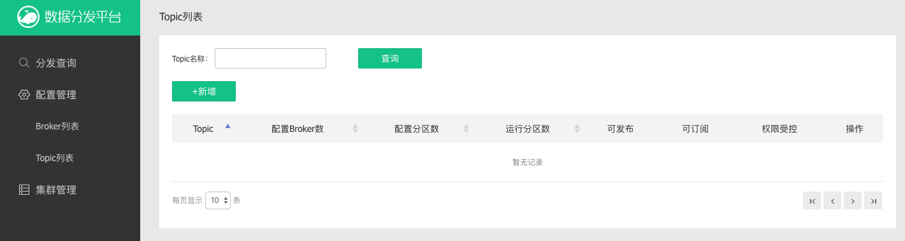
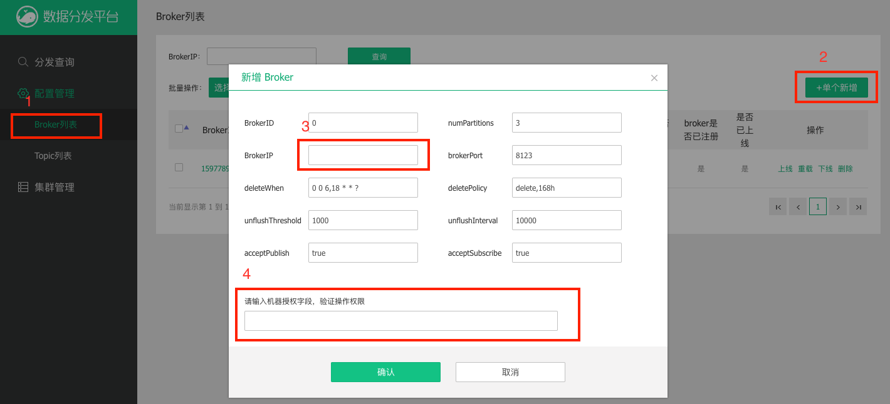
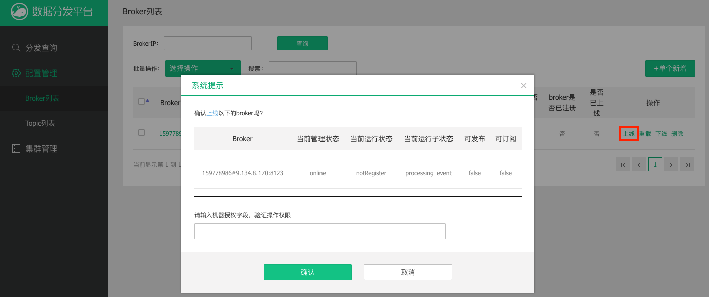
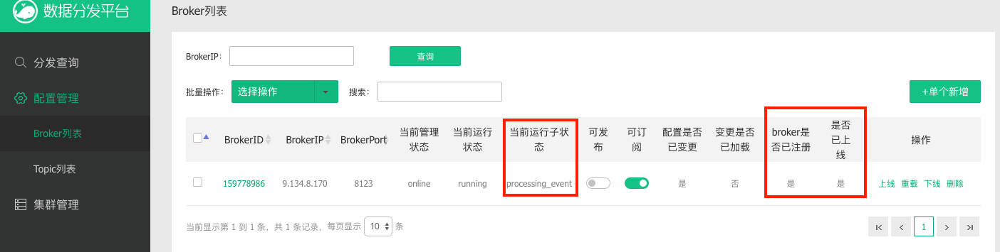
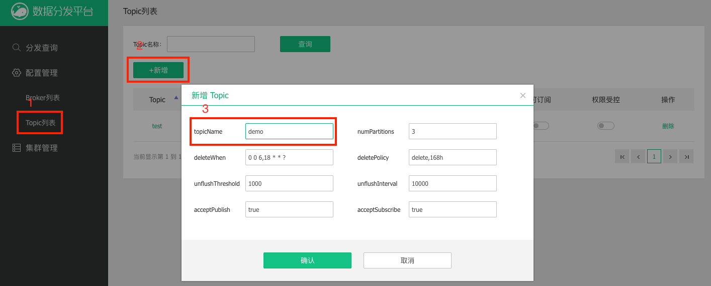
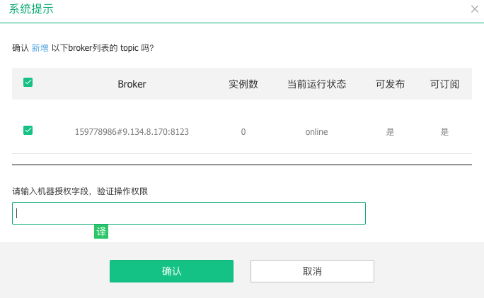
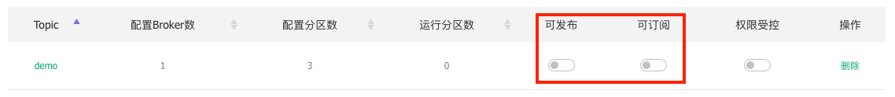
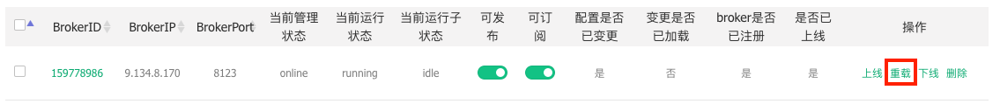
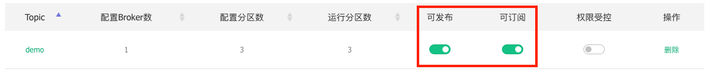

# TubeMQ User Guide
## Prerequisites

- Java 1.7 or 1.8(Java 9 and above haven't been verified yet)
- Maven
- [protoc 2.5.0](https://github.com/protocolbuffers/protobuf/releases/tag/v2.5.0)

## Build

### Build distribution tarball
Go to the project root, and run
```bash
mvn clean package -DskipTests
```
If you want to build each module of the project separately, you need to run `mvn install` in the project root at first.
### Build source code
If you want to build and debug source code in IDE, go to the project root, and run

```bash
mvn compile
```

This command will generate the Java source files from the `protoc` files, the generated files located in `target/generated-sources`.

When this command finished, you can use IDE import the project as maven project.

## Deploy
After the build, please go to `tubemq-server/target`. You can find the
**tubemq-server-x.x.x-bin.tar.gz** file. It is the server deployment package, which includes
scripts, configuration files, dependency jars and web GUI code.

For the first time deployment, we just need to extract the package file. For example, we put these
files into the `/opt/tubemq-server`, here's the folder structure.
```
/opt/tubemq-server
├── bin
├── conf
├── lib
├── logs
└── resources
```
## Configure
There're two roles in the cluster: **Master** and **Broker**. Master and Broker
can be deployed on the same server or different servers. In this example, we setup our cluster
like this, and all services run on the same node. Zookeeper should be setup in your environment also.

| Role | TCP Port | TLS Port | Web Port | Comment |
| ---- | -------- | -------- | -------- | ------- |
| Master | 8099 | 8199 | 8088 | Meta data is stored at /stage/metadata |
| Broker | 8123 | 8124 | 8081 | Message is stored at /stage/msgdata |
| Zookeeper | 2181 | | | Offset is stored at /tubemq |

You can follow the example below to update the corresponding config files. Please notice that the **YOUR_SERVER_IP** should
be replaced with your server IP.

##### conf/master.ini
```ini
[master]
hostName=YOUR_SERVER_IP
port=8000
webPort=8088
consumerBalancePeriodMs=30000
firstBalanceDelayAfterStartMs=60000
consumerHeartbeatTimeoutMs=30000
producerHeartbeatTimeoutMs=45000
brokerHeartbeatTimeoutMs=25000
confModAuthToken=abc
webResourcePath=/opt/tubemq-server/resources

[zookeeper]
zkNodeRoot=/tubemq
zkServerAddr=localhost:2181
zkSessionTimeoutMs=30000
zkConnectionTimeoutMs=30000
zkSyncTimeMs=5000
zkCommitPeriodMs=5000

[bdbStore]
bdbRepGroupName=tubemqMasterGroup
bdbNodeName=tubemqMasterGroupNode1
bdbNodePort=9001
bdbEnvHome=/stage/metadata
bdbHelperHost=9.134.8.170:9001
bdbLocalSync= 1
bdbReplicaSync= 3
bdbReplicaAck= 1
bdbStatusCheckTimeoutMs=10000
```

##### resources/velocity.properties
```properties
resource.loader=file
file.resource.loader.description=Velocity File Resource Loader
file.resource.loader.class=org.apache.velocity.runtime.resource.loader.FileResourceLoader
file.resource.loader.path=/opt/tubemq-server/resources/templates
file.resource.loader.cache=false
file.resource.loader.modificationCheckInterval=2
string.resource.loader.description=Velocity String Resource Loader
string.resource.loader.class=org.apache.velocity.runtime.resource.loader.StringResourceLoader
```

##### conf/broker.ini
```ini
[broker]
brokerId=0
hostName=YOUR_SERVER_IP
port=8123
webPort=8081
masterAddressList=YOUR_SERVER_IP:8000
primaryPath=/stage/msgdata
maxSegmentSize=1073741824
maxIndexSegmentSize=22020096
transferSize= 524288
loadMessageStoresInParallel=true
consumerRegTimeoutMs=35000

[zookeeper]
zkNodeRoot=/tubemq
zkServerAddr=localhost:2181
zkSessionTimeoutMs=30000
zkConnectionTimeoutMs=30000
zkSyncTimeMs=5000
zkCommitPeriodMs=5000
zkCommitFailRetries=10

```

You also need to update your `/etc/hosts` file on the master servers. Add other master
server IPs in this way, assume the ip is `192.168.1.2`:
##### /etc/hosts
```
192.168.1.2 192-168-1-2
```

## High Availability

In the example above, we run the services on a single node. However, in real production environment, you
need to run multiple master services on different servers for high availability purpose. Here's
the introduction of availability level.

| HA Level | Master Number | Description |
| -------- | ------------- | ----------- |
| High | 3 masters | After any master crashed, the cluster meta data is still in read/write state and can accept new producers/consumers. |
| Medium | 2 masters | After one master crashed, the cluster meta data is in read only state. There's no affect on existing producers and consumers. |
| Minimum | 1 master | After the master crashed, there's no affect on existing producer and consumer. |

Please notice that the master servers should be clock synchronized.

## Start Master
After update the config file, please go to the `bin` folder and run this command to start
the master service.
```bash
./master.sh start
```
You should be able to access `http://your-master-ip:8088/config/topic_list.htm` to see the
web GUI now.



## Start Broker
Before we start a broker service, we need to configure it on master web GUI first.

Go to the `Broker List` page, click `Add Single Broker`, and input the new broker 
information.



In this example, we only need to input broker IP and authToken:
1. broker IP: broker server ip
2. authToken: A token pre-configured in the `conf/master.ini` file. Please check the
`confModAuthToken` field in your `master.ini` file.

Click the online link to activate the new added broker.



Go to the broker server, under the `bin` folder run this command to start the broker service
```bash
./broker.sh start
```

Refresh the GUI broker list page, you can see that the broker now is registered.

After the sub-state of the broker changed to `idle`, we can add topics to that broker.



## Add Topic
We can add or manage the cluster topics on the web GUI. To add a new topic, go to the
topic list page and click the add new topic button



Then select the brokers which you want to deploy the topics to.



We can see the publish and subscribe state of the new added topic is still grey. We need
to go to the broker list page to reload the broker configuration.





When the broker sub-state changed to idle, go to the topic list page. We can see
that the topic publish/subscribe state is active now.




Now we can use the topic to send messages.

## Demo
Now we can run the example to test our cluster. First let's run the produce data demo. Please don't
forget replace `YOUR_SERVER_IP` with your server ip.
```bash
java -Dlog4j.configuration=file:/opt/tubemq-server/conf/tools.log4j.properties  -Djava.net.preferIPv4Stack=true -cp  /opt/tubemq-server/lib/*:/opt/tubemq-server/conf/*: com.tencent.tubemq.example.MessageProducerExample YOUR_SERVER_IP YOUR_SERVER_IP:8000 demo 10000000
```
From the log, we can see the message is sent out.
```bash
[2019-09-11 16:09:08,287] INFO Send demo 1000 message, keyCount is 268 (com.tencent.tubemq.example.MessageProducerExample)
[2019-09-11 16:09:08,505] INFO Send demo 2000 message, keyCount is 501 (com.tencent.tubemq.example.MessageProducerExample)
[2019-09-11 16:09:08,958] INFO Send demo 3000 message, keyCount is 755 (com.tencent.tubemq.example.MessageProducerExample)
[2019-09-11 16:09:09,085] INFO Send demo 4000 message, keyCount is 1001 (com.tencent.tubemq.example.MessageProducerExample)
```

Then we run the consume data demo. Also replace the server ip
```bash
java -Xmx512m -Dlog4j.configuration=file:/opt/tubemq-server/conf/tools.log4j.properties -Djava.net.preferIPv4Stack=true -cp /opt/tubemq-server/lib/*:/opt/tubemq-server/conf/*: com.tencent.tubemq.example.MessageConsumerExample YOUR_SERVER_IP YOUR_SERVER_IP:8000 demo demoGroup 3 1 1
```
From the log, we can see the message received by the consumer.

```bash
[2019-09-11 16:09:29,720] INFO Receive messages:2500 (com.tencent.tubemq.example.MsgRecvStats)
[2019-09-11 16:09:30,059] INFO Receive messages:5000 (com.tencent.tubemq.example.MsgRecvStats)
[2019-09-11 16:09:34,493] INFO Receive messages:10000 (com.tencent.tubemq.example.MsgRecvStats)
[2019-09-11 16:09:34,783] INFO Receive messages:12500 (com.tencent.tubemq.example.MsgRecvStats)
```

---
<a href="#top">Back to top</a>
